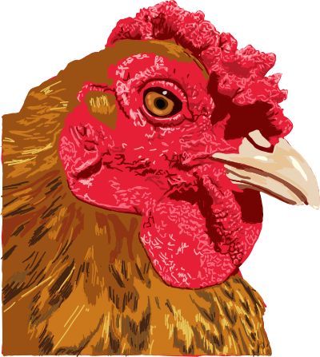

<!-- Listen, I know align=center is basically deprecated, but it's GitHub. You use what you can, because there's not a lot of that going around. -->

	
	<h3 align="center">Chicken traits</h3>
	

		A simple Endless Legend (Community Patch edition) mod that adds some traits.
	

Table of Contents

* [Features](#features)
* [References](#references)
* [Sources](#sources)

 

# Features

- Volcanic Nourishment.
	Unique to the Kapaku faction. It's a counter-balance to ELCP's overly aggressive nerf of the faction, and simply lets Kapaku get food from the tiles they're actually meant to, relative to the lore and the base game.
- Hobnob's Greed: Strategic.
	A tiered trait that lets you start with some strategic resources at the beginning of the game.

# Sources

**Logo**
- Description:
	- English: A chicken with a beans comb
	- 日本語: 豆冠のニワトリ
- Date: 1 April 2024
- Source: https://doi.org/10.7875/togopic.2024.066
- Author: DataBase Center for Life Science (DBCLS)

# References

+ [@Amplifiers LeaderEnemyBoss]. (2018, May 20). *Endless legend community patch - Endless legend.* Amplifiers (Games2Gether). Retrieved May 26, 2024, from https://community.amplitude-studios.com/amplitude-studios/endless-legend/forums/15-modding/threads/30618-endless-legend-community-patch

+ [@GitHub LeaderEnemyBoss]. (2018, August 28). *The endless legend community patch.* GitHub. Retrieved May 30, 2024, from https://github.com/LeaderEnemyBoss/ELCP

+ Amplitude Studios. (2014, October 29). *Tutorials for Modding endless legend.* Amplifiers (Games2Gether). Retrieved May 27, 2024, from https://community.amplitude-studios.com/amplitude-studios/endless-legend/forums/15-modding/threads/5777-tutorials-for-modding-endless-legend

+ Amplitude Studios. (2016). *Modding tutorial - Revision 5.* Games2Gether. Retrieved May 27, 2024, from https://medias.games2gether.com/forums/Pikou/tutorial-modding.pdf